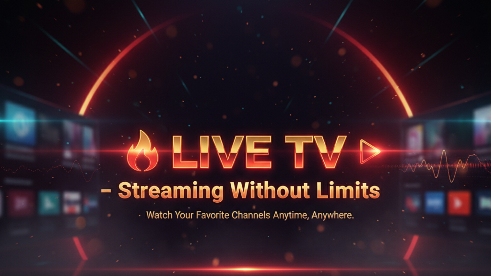
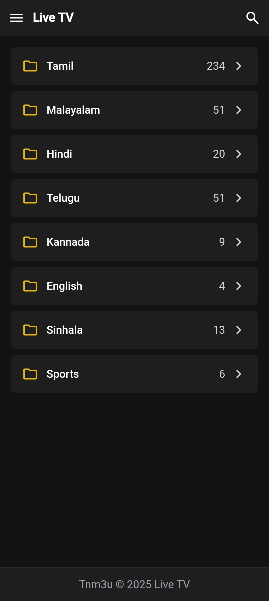
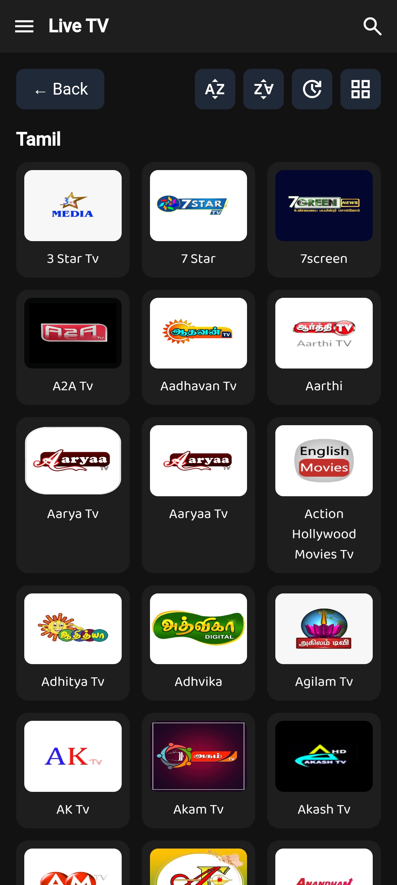
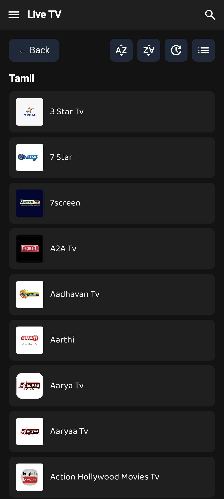

# 📺 Live TV - IPTV Panel & Playlist

  

  <b>A premium live TV streaming platform built for users in the mind with low cost and low maintenance</b> 
  Enjoy <b>playlist</b> with instant streaming of your favorite channels.

---

  <!-- GitHub Stats Badges -->
  
  
  
  

---

## 🎬 Admin Panel Demo  

  <a href="http://tnm3u.linkpc.net">Visit Demo Panel</a>

---

## ✨ Features  

- 💎 **Premium Netflix-style UI** – Dark theme, smooth transitions & hover effects  
- 📺 **HLS Live Streaming** – Supports `.m3u8` playback via HLS.js  
- 🔍 **Smart Browsing** – Categories, A–Z sorting, search, and recently watched  
- 📱 **Fully Responsive** – Works on mobile, tablet, and desktop  
- ⚡ **Realtime Updates** – Powered by Firebase Realtime Database  

---

## 📥 Download Android App  

  

---

## 📸 Screenshots  

  
  
  

---

## 🌐 Curated Playlists  

| Category     | Playlist Link |
|-------------|------------------|
| All Channels | [tnm3u.live/tv.m3u](https://tnm3u.live/tv.m3u) |
| Tamil 🎭    | [tnm3u.live/tn.m3u](https://tnm3u.live/tn.m3u) |
| Telugu 🎶   | [tnm3u.live/an.m3u](https://tnm3u.live/an.m3u) |
| Malayalam 🎥| [tnm3u.live/kl.m3u](https://tnm3u.live/kl.m3u) |
| Kannada 🎬  | [tnm3u.live/ka.m3u](https://tnm3u.live/ka.m3u) |
| English 🎤  | [tnm3u.live/en.m3u](https://tnm3u.live/en.m3u) |

---

## 🛠 Tech Stack  

- **Frontend:** HTML, JavaScript, Tailwind CSS  
- **Streaming:** HLS.js  
- **Backend:** Firebase Realtime Database  
- **Hosting:** GitHub Pages  

---

## 📊 GitHub Insights  

  

---

## 📜 License  

This project is licensed under **MIT License** – free to use, modify & distribute.  

---

## 👨‍💻 Author  

  Built with ❤️ by <b>Palani</b> (@ppsmrt)  
   
  

